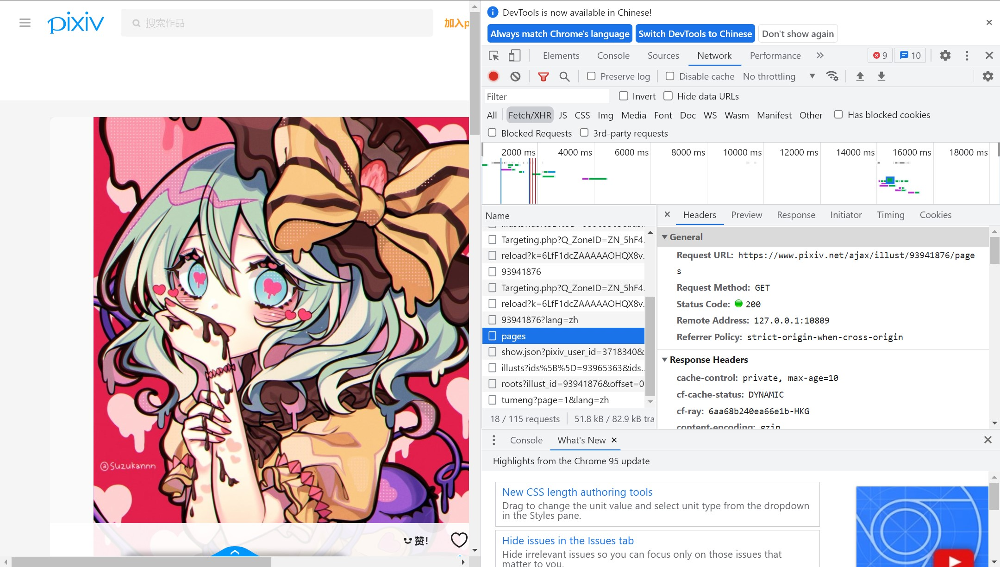
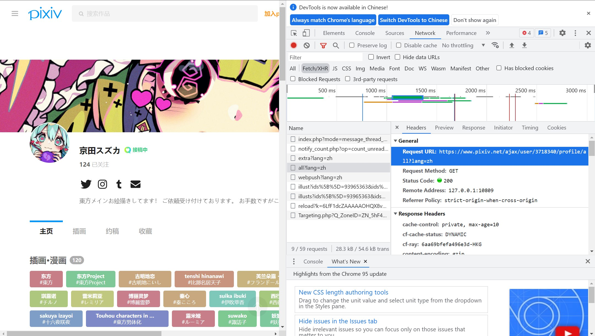

# pixiv_spider
这是一个使用scrapy框架爬取pixiv上某画师的所有插画的一个爬虫  
使用python版本为`python3.7`   
本爬虫以 [京田スズカ](https://www.pixiv.net/users/3718340) 画师为例进行爬取 
***
### 注意  
使用之前需要配置`settings.py`文件`DEFAULT_REQUEST_HEADERS`中的`cookie`以及`middlewares.py`文件中的代理服务器  
  
`cookie`的查看方法如下图所示    

  

寻找方法
1. 点击进入画师主页
2. 随便打开画师的一张图
3. 点击F12键打开开发者工具
4. 找到pages
5. 向下划找到cookie

***
### PS
如果想要爬取其他画师的图片，可以根据自己需要对爬虫主文件`pixiv.py`中的`start_urls`进行修改  
  
具体的链接获取方式如下  

  

链接在`all?lang=zh`文件中  

~~但实际操作时只需修改画师的pid就可以，没必要整个链接都改x~~

***
### PSS
在实际测试中会出现一些文件重命名失败的情况，目前不知道原因是什么，自己手动修改就好  

第一次写爬虫，写的不好的地方还请多多指正

